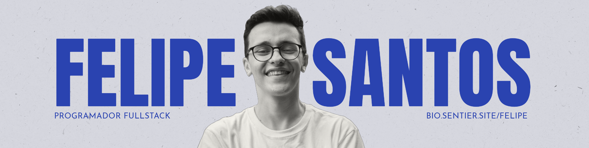

### 💻 Tecnologias que uso:
- **Frontend:** React, Next.js, TypeScript
- **Backend:** Express, Node.js, Prisma
- **Banco de Dados:** PostgreSQL, Firebase
- **Design:** Figma, Photoshop

### 📚 Atualmente aprendendo:
- Gateway de Pagamentos

### 🛠️ Ferramentas e Tecnologias:
- Git/GitHub
- Vercel
- Insominia
- Neon ou Railway

### 🌱 Objetivos:
- Continuar evoluindo em **React/Next.js**
- Expandir meu conhecimento em **Arquitetura de Software**
- Contribuir para projetos Open Source

---

### 📈 GitHub Stats:

---

---

### 🧑‍💻 Projetos Destacados:

- **[Nome do Projeto 1](link_para_o_projeto):** Descrição breve do projeto.
- **[Nome do Projeto 2](link_para_o_projeto):** Descrição breve do projeto.
- **[Nome do Projeto 3](link_para_o_projeto):** Descrição breve do projeto.

### 📍 Localização:
- Atualmente morando no **Brasil** 🇧🇷

