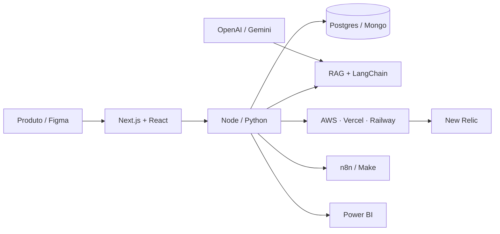

<h1 align="center">Felipe P. dos Santos</h1>

  <strong>Full Stack Pleno</strong> · Web · Cloud · IA · Automação 
  Curitiba, Brasil · em produção desde 2021

  
  
  

Eu construo aplicações web que aguentam escala de verdade: da prototipação no Figma ao deploy, monitoramento e suporte de milhares de pessoas. Integro IA no fluxo de trabalho — e no produto — de forma sustentável. O resto é consequência: menos retrabalho, mais decisão.

---

## Runtime

  

| Camada | O que entra em produção |
| :--- | :--- |
| **Front-end** | Next.js · React · TypeScript · JavaScript · Tailwind CSS · HTML · CSS · GSAP |
| **Back-end** | Python · Node.js · Express · Prisma · PostgreSQL · MongoDB · APIs REST · Auth · DDD |
| **Cloud & DevOps** | AWS (S3, SQS, Lambda, EKS) · Docker · CI/CD · Git Flow · Vercel · Railway · ArgoCD · New Relic |
| **IA & LLMs** | LangChain · RAG · OpenAI SDK · Gemini · gestão de contexto · prompt engineering · Copilot |
| **Automação & dados** | Make · n8n · Power BI · Figma · Scrum |

```mermaid
flowchart LR
  P[Produto / Figma] --> FE[Next.js + React]
  FE --> API[Node / Python]
  API --> DB[(Postgres / Mongo)]
  API --> AI[RAG + LangChain]
  LLM[OpenAI / Gemini] --> AI
  API --> CLOUD[AWS · Vercel · Railway]
  CLOUD --> OBS[New Relic]
  API --> AUTO[n8n / Make]
  API --> BI[Power BI]
```

---

## Changelog

Trajetória versionada. Cada release com o que realmente mudou no negócio.

### 2026.x — Grupo Boticário
**Engenheiro de Software Pleno** · jan 2026 → agora

`feat(industria)` ponto focal da modernização do suporte fabril: RAG sobre documentação técnica, dashboards de BI para a gestão e redesenho de processos em BPMN, com integrações entre sistemas.

`feat(pwa)` decisões técnicas do **App Super** — gestão de **+5.000 colaboradores** em React, Node.js, MongoDB/DocumentDB e SSO. Deploy e observabilidade com o time de DevOps (AWS, EKS, S3, ArgoCD, New Relic).

`perf` dezenas de planilhas de horas, folgas e matriz de habilidades saíram de cena. **+20%** de produtividade dos coordenadores, **−10%** no tempo de alocação. Governança de um custo operacional de **R$ 63 milhões/ano**.

### 2025.x — ASSUMTEK
**Full Stack Pleno & Tech Lead** · jan 2025 → jan 2026

`feat(rh)` plataforma interna do zero (Node, Postgres, Next, Vercel, Railway): jornada PJ, folha, travas de horas, aprovações e cálculo dinâmico de remuneração. **−70%** no tempo do RH no fechamento da folha.

`feat(lead)` arquitetura, backlog, code review e 1:1. O time evolui; o produto não fica órfão.

`feat(martech)` jornadas inteiras ligadas — Meta Ads, CRMs e base interna — com Node.js, n8n e Make. Pipelines Node/Python alimentando Power BI para Produto, Marketing, TI, RH e clientes B2B.

### 2021.0 — Sentier
**Fundador & Full Stack · soluções B2B & SaaS** · jan 2021 → jan 2025

`feat(*)` **+40 produtos** entregues ponta a ponta: sistemas sob medida, LPs, automações e BI. Do Figma ao ar.

`feat(saas)` gestão multi-tenant para barbearias: agenda, folha, assinaturas e lembretes. Next.js, Node.js, Prisma, AWS S3, Resend e Vercel. **+7.000 usuários**. **17–20%** menos tempo na operação dos clientes.

---

## Projetos em evidência

O que dá para abrir no GitHub — o restante mora no [portfólio](https://mefelipe.com.br).

| Repo | O que é |
| :--- | :--- |
| **[aspas-note](https://github.com/Tiodevs/aspas-note)** | Frases com origem preservada + repetição espaçada (SM-2). Monorepo TS: Next, Node, Prisma, Postgres/Mongo, Docker. |
| **[web-portifolio](https://github.com/Tiodevs/web-portifolio)** | O site em [mefelipe.com.br](https://mefelipe.com.br) — projetos, stack e contato. |
| **[chat-ddd](https://github.com/Tiodevs/chat-ddd)** | Chat em tempo real como laboratório de DDD, Clean Architecture, WebSockets, RabbitMQ e Redis. |
| **[newsletter-api-aws](https://github.com/Tiodevs/newsletter-api-aws)** | Newsletter serverless: SQS, workers e logs no S3. |

No portfólio também está o **IA CHAT** (2025): especificações funcionais para consultores SAP que saíram de horas para minutos — backend, frontend e DevOps no mesmo PR.

---

## Formação

| Quando | O quê |
| :--- | :--- |
| 2021 – 2025 | **ADS** · FAEL |
| 2025 | **Programa Desenvolve** · Grupo Boticário — Full Stack, Node, React, Next, IA |
| 2025 | **Business Fundamentals** · Harvard Business Education |
| 2025 | **Análise de Dados & BI** · Google |
| 2021 | **CS50x** · Harvard University |
| 2021 | **AWS Academy Cloud Foundations** |

---

## Fora do horário comercial

Software também é gente.

- **Global Shapers Community** (Fórum Econômico Mundial) — professores da rede pública usando IA no planejamento de aula; treino para identificar e denunciar sinais de abuso infantil nas escolas.
- **A Igreja de Jesus Cristo dos Santos dos Últimos Dias** (2023–2024) — liderança regional no Sul do Brasil e sistemas/Power BI para 20 acampamentos nacionais.
- **Hospital Erasto Gaertner** e **ONG Afeka** — música e fotografia com pacientes oncológicos; web e audiovisual para populações vulneráveis.
